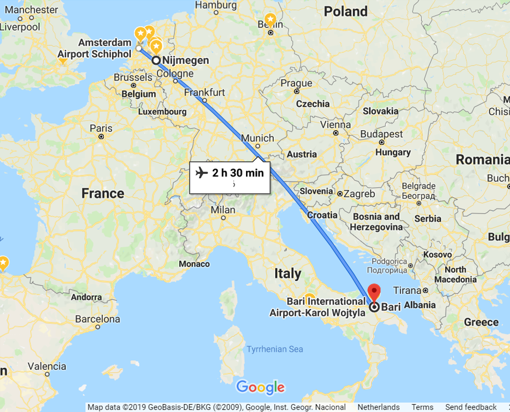
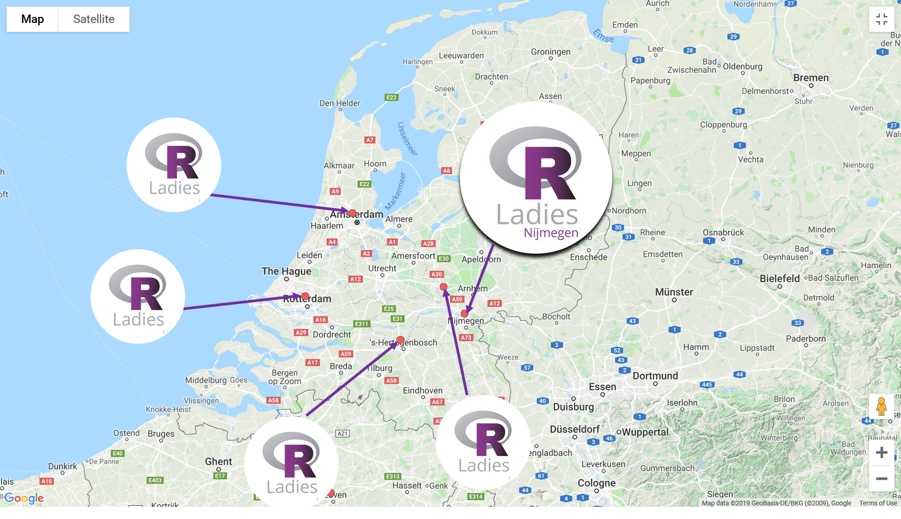
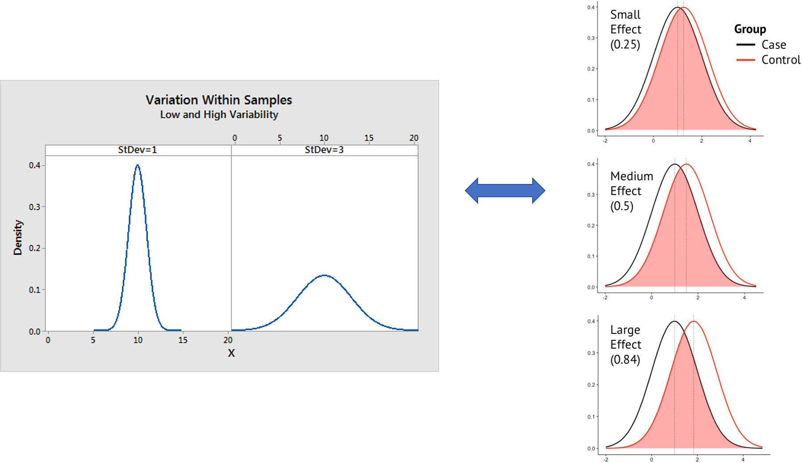
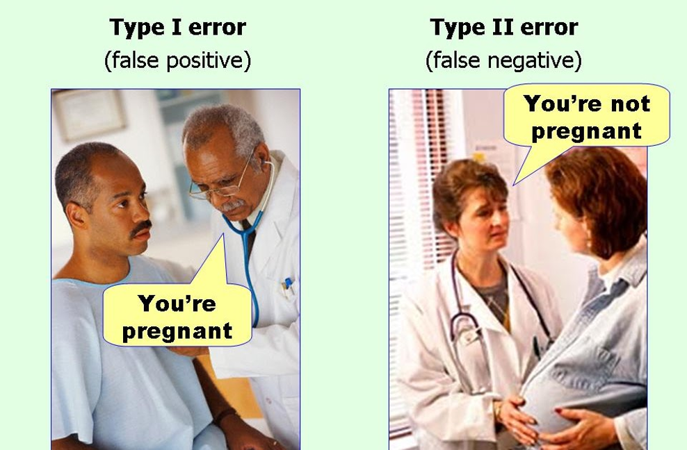
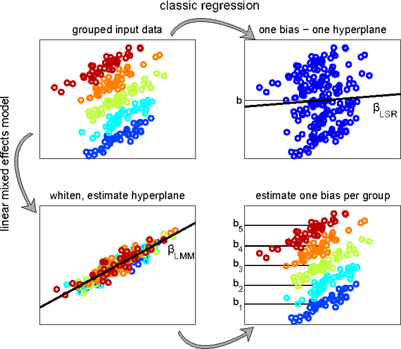
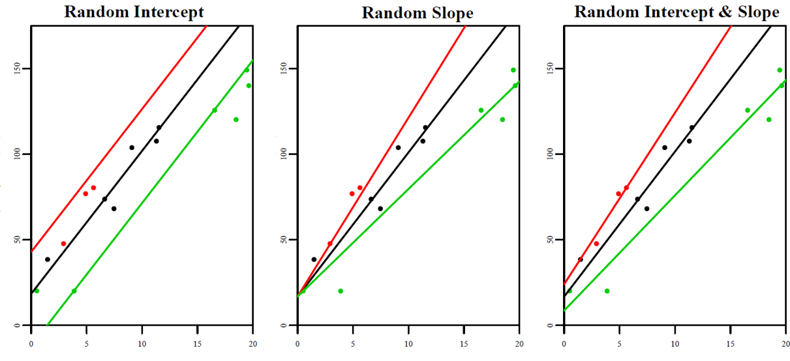

## Due cose su di me 

- Originaria della provincia di Latina
- Trasferita in Olanda dal 2015 
- Ultimi 4 mesi del dottorato in Psicologia cognitiva del linguaggio al Max Planck Institute for Psycholinguistics a Nijmegen
- Ho imparato R e statistica in inglese, quindi mi dovete scusare se non so i termini in italiano :)
- Main co-founder di Rladies Nijmegen (2017)

---

---
RLadies in Olanda:

## Psicologia cognitiva

studia il comportamento delle persone in relazione a degli stimoli  
(e come il cervello supporta tali comportamenti)

## Cosa e' indispensabile?

- Persone, i.e., partecipanti (possibilmente pagati)
- Stimoli esterni (e.g., presentati su display or attraverso speakers)
- Il conseguente comportamento (quantificabile in qualche modo)

## Prova tu! Piccolo esperimento 

A:
https://www.psytoolkit.org/cgi-bin/psy2.5.3/survey?s=87UDX

B:
https://www.psytoolkit.org/cgi-bin/psy2.5.3/survey?s=DDWEb

## Le sfide della psicologia cognitiva

Alta variabilita' ed effetti minuscoli:

## Statisticamente parlando…

Idealmente:

## o anche..

## Mixed-effect models

Invece di forzare (ed aggregare) i dati,  
modelliamo gli effetti “random”  
che non dipendono dalle nostre variabili indipendenti.

## Mixed-effect models

## Fixed vs random effects

## Random intercepts e slopes

